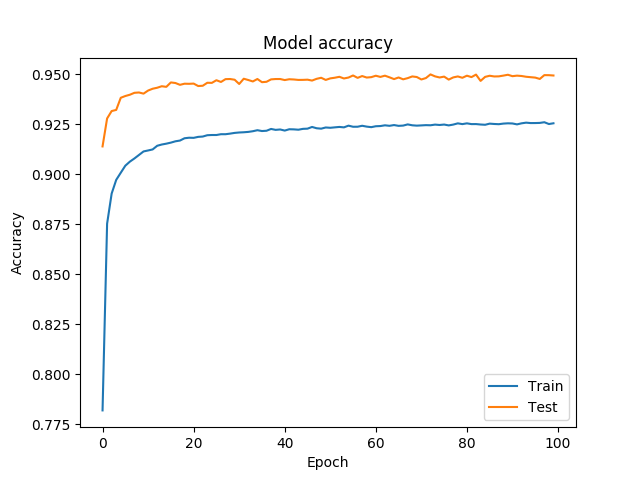
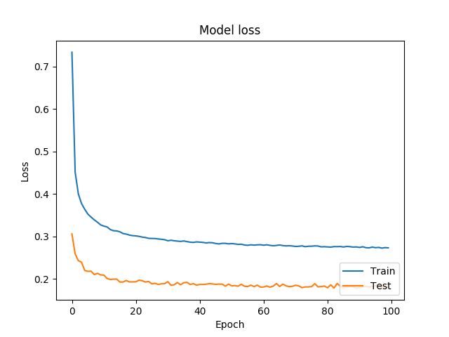
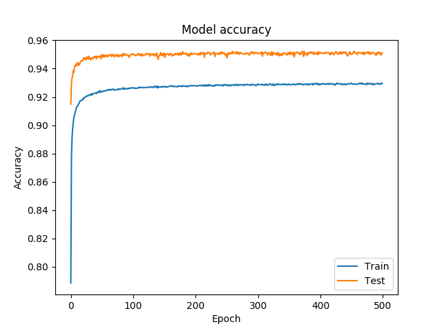

# Draw doodle

This repository contains a small project to get myself a bit more familiar with deep
learning networks using convolution layers. The goal of this project was to create
a neural network that is able to recognize hand-drawn doodles using the Google
dataset of Quick Draw (more info can be found [here](https://github.com/googlecreativelab/quickdraw-dataset "Quick Draw")
). To test out if the network is able to recognize some doodles, I also created a
simple webpage where it is possible to draw a doodle yourselves and see if the
network is able to recognize it.

If you want to try out the results of this project, go to the following web url:
## https://jurjen96.github.io/doodle-draw/

## Model

Model: "sequential_1"

Layer (type)                 | Output Shape           |    Param #    
-----------------------------|------------------------| ----------
conv2d_1 (Conv2D)            | (None, 28, 28, 16)     |   160       
conv2d_2 (Conv2D)            | (None, 28, 28, 16)     |   2320      
activation_1 (Activation)    | (None, 28, 28, 16)     |   0         
max_pooling2d_1 (MaxPooling2 | (None, 14, 14, 16)     |   0         
dropout_1 (Dropout)          | (None, 14, 14, 16)     |   0         
conv2d_3 (Conv2D)            | (None, 14, 14, 32)     |   4640      
conv2d_4 (Conv2D)            | (None, 14, 14, 32)     |   9248      
activation_2 (Activation)    | (None, 14, 14, 32)     |   0         
max_pooling2d_2 (MaxPooling2 | (None, 7, 7, 32)       |   0         
dropout_2 (Dropout)          | (None, 7, 7, 32)       |   0         
conv2d_5 (Conv2D)            | (None, 7, 7, 64)       |   18496     
conv2d_6 (Conv2D)            | (None, 7, 7, 64)       |   36928     
activation_3 (Activation)    | (None, 7, 7, 64)       |   0         
max_pooling2d_3 (MaxPooling2 | (None, 3, 3, 64)       |   0         
dropout_3 (Dropout)          | (None, 3, 3, 64)       |   0         
flatten_1 (Flatten)          | (None, 576)            |   0         
dense_1 (Dense)              | (None, 64)             |   36928     
dropout_4 (Dropout)          | (None, 64)             |   0         
dense_2 (Dense)              | (None, 14)             |   910       

Total params: 109,630  
Trainable params: 109,630  
Non-trainable params: 0  

Note: Only after writing this readme, I noticed how many trainable parameters
there are. Way more than I originally expected.

Results after training network described above trained on 14 different doodles:





With the test set we get the following accuracy and loss:
- Test loss: 0.17765145952051337
- Test accuracy: 0.9501298666000366

Just for fun I also trained the model for 500 epochs to see if it would overfit
or maybe even improve without overfitting. The result after 500 epochs is
almost the same as 100 epochs, but it took about 3.5 hours more to train the model.



With the test set:
- Test loss: 0.17384196315836942
- Test accuracy: 0.9506926536560059

## Setup local development

### Python
1. Create a folder in the root of this project called `data`:
```
$ git clone https://github.com/jurjen96/doodle-draw
$ cd doodle-draw # Go to root of the project
$ mkdir data # Create a folder called data
```
2. Get the .npy dataset from the Google bucket:
```
$ cd data
$ gsutil -m cp gs://quickdraw_dataset/full/numpy_bitmap/*.npy . # Get's everything
$ gsutil -m cp gs://quickdraw_dataset/full/numpy_bitmap/airplane.npy . # Only get's the airplane dataset
```
3. Optional, but recommended, create a virtual environment:
```
$ cd ..
$ pip3 install virtualenv # If you have not yet installed virtualenv
$ virtualenv venv
$ source venv/bin/activate
```
4. Install all the dependencies. Note that everything was trained of the GPU.
Some packages require you to have CUDA installed (e.g. tensorflow-gpu).
```
$ pip3 install -r requirements.txt
```
5. Run the code:
```
$ python3 main.py
```
6. When the variable `REBUILD_DATA` is set to True, it gets the raw .npy
files and creates new training data by getting all the features and
labels and storing them in the `object_features.npy` and `object_label.npy`
files. You only have to do this action once, so the second time you want
to train the model, you could set the `REBUILD_DATA` to False and it will use
the two files described above to save you some time. After the training
is completed, the model is saved under a `*.h5` extension.

7. If you want to test out the trained model in a web environment, you
have to convert the `.h5` file to a `.json` and a `.bin` file so that it
can be imported into tensorflowjs. Change the `NAME_OF_TRAINED_MODEL` to
the name of the `.h5` file created in step 6:
```
$ tensorflowjs_converter --input_format=keras NAME_OF_TRAINED_MODEL.h5 ./object_model
```
8. You should now see a new folder called `object_model` which contains two files,
namely:`model.json` and `group1-shared1of1.bin`. These files can now be used
to import the trained model into the web environment.  

### JavaScript

1. For local web development we need a server to host the trained model
and not have to worry about CORS (Cross-Origin Resource Sharing). To do
so, I installed an extension that allows you to start a web server in
chrome. You can download the tool [here](https://chrome.google.com/webstore/detail/web-server-for-chrome/ofhbbkphhbklhfoeikjpcbhemlocgigb "Web server for chrome").
2. The next step is to run the extension, set the folder to the root
of this project and you are done. The web project is now hosted on:
```
http://127.0.0.1:8887/
```
3. Every time you change the `index.html` or `draw.js`, you only have to refresh
the page to apply your new changes.

Please note that the webpage was developed to be functional, not to deliver the
best UI experience possible ;-)
